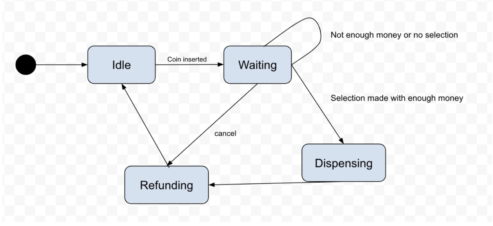
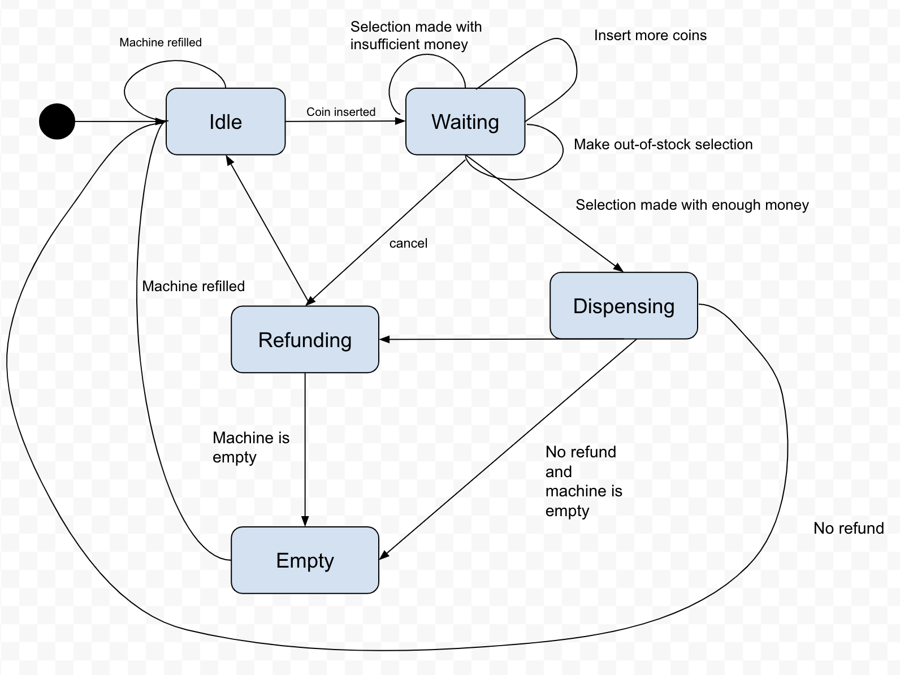
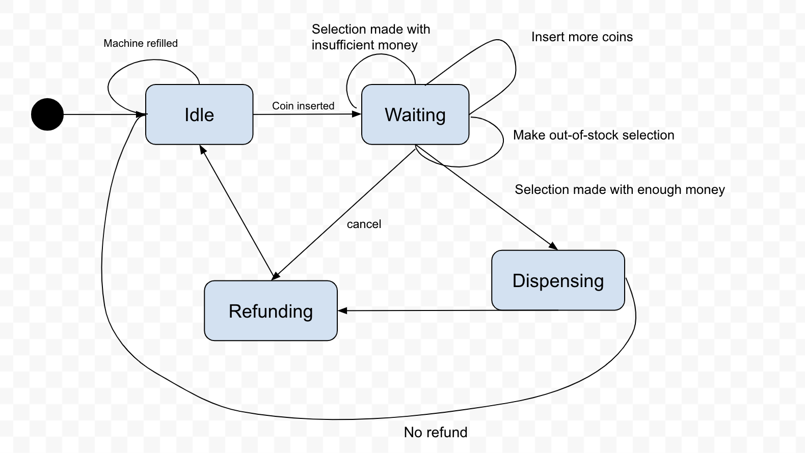

# vending-machine-fsm

# Vending Machine - FSM Implementation in Python

### What is this? 
This is an implementation of a Finite State Machine for a vending machine. It is interactive, so all the states and transitions are controlled directly by user input. 

### Usage
`main.py` and `vending_machine.py` contain all the code required to interact with the vending machine. 

### Prerequisites
There are no requirements besides the installation of Python.

### Running 
Once you have unzipped the file, cd into the `vending-machine-fsm` directory from the command line and use `python main.py` to run the program. Enjoy!

### Given more time...Ideas to improve: 
1. ASCII GUI - A graphical representation of the vending machine.
2. More sophisticated 'refund' system—return change to the user in the form of coins and bills rather than the raw amount.

## Process - Design

I started by researching how finite state machines are designed—this helped me realize that a logical first step would be to create a diagram of the state machine and determine all the possible states and transitions. I started with four main states: 

1. Idle - waiting for input
2. Waiting: user inserts coins and can select item or cancel
3. Dispensing - gives item and processes money
4. Refunding - gives change

Using this, I created the following diagram: 

As I was  considering how I would implement this in code, I realized that the "actions" (the words next to each arrow) had to be actual events/actions that could take place—events like "no selection" were not necessary. I also decided to add an "Empty" state which the machine would enter if all items went out of stock. After adding a few more transitions/actions and the Empty state, my diagram looked like this: 

However, as I began to implement the machine in code, I realized that the "Empty" state was redundant; in real life, users can still interact with empty vending machines (they just can't actually buy anything). The "Empty" state didn't need to be an individual state; rather, an empty vending machine was already being handled by my "Waiting" state, where a user is unable to purchase an item that is out of stock. 

My final diagram is: 

## Process - Code

For the sake of simplicity, I decided to implement my vending machine FSM using just one class. States are represented by individual variables, and functions control the transitions between states. This FSM does not terminate on its own—it is entirely controlled by user input. 

## Reflection

Although the coding portion of this project ended up taking more time overall than the planning/diagramming phase, I was surprised by how much time I spent planning out the states, transitions, actions, and overall structure of the FSM. It was challenging to land on a final design that I felt was simple enough to the point where each state had a clear purpose, but also wasn't too simple and still covered everything I wanted it to. Looking back, my earlier addition of an "Empty" state definitely evidences the fact that I was overcomplicating things at the start. In fact, now that I've written the program itself, I feel like I might even have been able to get away with eliminating the "Idle" state—while this might have made the "Waiting" state a little more complicated and heavy, I don't think there's anything that needs to be uniquely handled in Idle. That being said, however, in order for my program to be as clear as possible to outside viewers/users, it's probably best to not oversimplify the design.

This project definitely challenged some of my previous biases around the idea of "more lines of code = better"—the underlying logic and reasoning behind the code in this project was definitely more important. In my previous final explorations, I jumped straight to coding and kind of figured things out as I went—however, I now realize how much easier it is to write code when you have a visual or even written "roadmap" of how your program will be structured. 

Overall, this was a really fun (if accidental) introduction to a phase in the software engineering process I previously didn't even know about! 